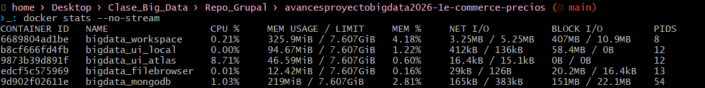
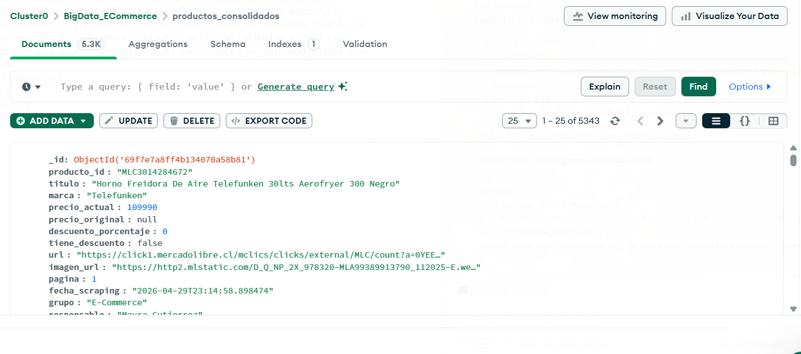

# Monitor de Precios E-Commerce Chile — Grupo 1
### Big Data para la Toma de Decisiones | UCN — Ingeniería en Información y Control de Gestión | 2026

---

## Equipo

| Integrante | Categoría | Colección Atlas | Documentos |
|---|---|---|---|
| Valentina Aróstica | Smartphones | `smartphones_mercadolibre` | 621 |
| Alondra Segovia | Televisores | `televisores_mercadolibre` | 540 |
| Luis Molina | Laptops | `laptops_mercadolibre` | — |
| Kimberly Neira | Tablets | `tablets_mercadolibre` | 572 |
| Ariel Peña | Auriculares | `auriculares_mercadolibre` | 567 |
| Mayra Gutierrez | Hornos | `hornos_mercadolibre` | 510 |

**Total acumulado:** 2,810+ documentos en MongoDB Atlas (`BigData_ECommerce`)

---

## Hito 1: Infraestructura y Captura de Datos

### Comando de ejecución

```bash
docker-compose up -d
```

Servicios que se levantan:

| Servicio | Descripción | Puerto |
|---|---|---|
| `bigdata_workspace` | Jupyter Lab + PySpark + entorno VNC | 8888 |
| `bigdata_mongodb` | MongoDB local para desarrollo | 27017 |
| `bigdata_ui_local` | Mongo Express (MongoDB local) | 8081 |
| `bigdata_ui_atlas` | Mongo Express (MongoDB Atlas) | 8082 |
| `bigdata_filebrowser` | Explorador de archivos del proyecto | 8083 |

---

### Evidencia 1 — Docker Stats

> Captura de pantalla de `docker stats` mostrando el consumo de los contenedores en ejecución.



---

### Evidencia 2 — Conteo de Documentos en MongoDB Atlas

> Captura de pantalla de MongoDB Compass o terminal mostrando el conteo por colección.

```js
// Comando ejecutado en MongoDB Compass (Shell)
use BigData_ECommerce
db.smartphones_mercadolibre.countDocuments()   // 621
db.televisores_mercadolibre.countDocuments()   // 540
db.tablets_mercadolibre.countDocuments()       // 572
db.auriculares_mercadolibre.countDocuments()   // 567
db.hornos_mercadolibre.countDocuments()        // 510
```



---

### Tabla de Atributos por Integrante

Todos los integrantes extraen el mismo esquema de 14 campos (superando el mínimo de 8 requerido):

| # | Campo | Tipo | Descripción |
|---|---|---|---|
| 1 | `producto_id` | `string` | ID único del producto en MercadoLibre (MLC-XXXXXXXX) |
| 2 | `titulo` | `string` | Nombre completo del producto |
| 3 | `marca` | `string` | Marca extraída automáticamente del título |
| 4 | `precio_actual` | `int` | Precio de venta actual en CLP |
| 5 | `precio_original` | `int` | Precio antes del descuento en CLP |
| 6 | `descuento_porcentaje` | `int` | Porcentaje de descuento aplicado |
| 7 | `tiene_descuento` | `bool` | `True` si el producto tiene oferta activa |
| 8 | `url` | `string` | URL del producto en MercadoLibre |
| 9 | `imagen_url` | `string` | URL de la imagen del producto |
| 10 | `pagina` | `int` | Página de búsqueda de la que se extrajo |
| 11 | `fecha_scraping` | `string` | Timestamp ISO 8601 de la captura |
| 12 | `grupo` | `string` | Identificador del grupo (`E-Commerce`) |
| 13 | `responsable` | `string` | Nombre del integrante que realizó la captura |
| 14 | `categoria` | `string` | Categoría del producto (smartphones, televisores, etc.) |

**Validación de tipos:** precios como `int`, booleanos como `bool`, fechas en ISO 8601. No se almacenan strings con símbolo `$`.

---

## Business Case

### 1. Situación Problema

En Chile, consumidores y retailers del sector electrónico toman decisiones de compra y fijación de precios **sin visibilidad histórica ni comparativa del mercado**:

- Un retailer no sabe si su precio de smartphones es competitivo frente a MercadoLibre en tiempo real.
- Un consumidor no puede distinguir si el "40% OFF" del CyberDay es una rebaja real o un precio inflado artificialmente días antes — práctica documentada por herramientas como **Knasta.cl**.
- Las decisiones de pricing se toman manualmente, sin datos históricos ni procesamiento a escala.

> **Referencia del mercado:** Knasta.cl es un comparador de precios chileno que usa IA para monitorear el historial de precios hasta 3 meses atrás y detectar descuentos falsos en retail. Nuestro proyecto replica esta lógica con infraestructura Big Data aplicada a MercadoLibre, expandible a múltiples fuentes.

### 2. Propuesta de Valor

Sistema automatizado de monitoreo de precios en MercadoLibre Chile para 6 categorías de electrónica, construido sobre infraestructura Big Data real (Spark + MongoDB Atlas):

| Capacidad | Impacto |
|---|---|
| Detectar descuentos reales vs. inflaciones artificiales | Consumidor toma decisiones informadas en CyberDay |
| Comparar precios entre 6 categorías simultáneamente | Retailer identifica en qué segmento es menos competitivo |
| Analizar marca dominante por categoría | Fabricante entiende su posición de mercado en Chile |
| Historial de precios con timestamp por producto | Detectar patrones de precio previos a eventos comerciales |
| Procesar 3,000+ registros con Spark | Análisis estadísticamente válido, no muestral |

### 3. Análisis de las 4V

#### Volumen
Necesitamos **3,000+ registros** (500 por persona × 6 integrantes) porque:
- Con menos de 500 registros por categoría, el margen de error estadístico supera el 5%, invalidando comparaciones entre marcas (~15 marcas × ~30 modelos c/u).
- El análisis de elasticidad precio-demanda requiere suficiente varianza para detectar patrones.
- Spark justifica su overhead de procesamiento distribuido solo con volúmenes que no caben en memoria de una sola máquina.

#### Variedad
Extraemos **14 etiquetas distintas** por producto en 3 dimensiones:
- **Pricing:** `precio_actual`, `precio_original`, `descuento_porcentaje`, `tiene_descuento`
- **Producto:** `titulo`, `marca`, `categoria`, `producto_id`, `url`, `imagen_url`
- **Metadata:** `fecha_scraping`, `pagina`, `grupo`, `responsable`

#### Veracidad
- **Validación de tipos:** precios como `int`, no `string "$299.990"`.
- **Filtro de outliers:** descarte de productos con precio < $30,000 CLP.
- **Filtro de accesorios:** lista de 30+ palabras clave para excluir productos mal categorizados.
- **Deduplicación:** `UpdateOne` con `upsert=True` actualiza precio si el `producto_id` ya existe.

#### Velocidad
**Frecuencia recomendada: Diaria (cada 24 horas)**

MercadoLibre actualiza precios múltiples veces al día. En eventos como CyberDay, los precios cambian cada hora. Para detectar inflaciones artificiales pre-oferta (como documenta Knasta.cl), se necesita al menos una captura diaria durante las 2 semanas previas al evento.

---

## Arquitectura del Sistema

```
MercadoLibre Chile
        │
        ▼  Selenium + BeautifulSoup
┌──────────────────────────────────┐
│  Scrapers individuales           │
│  (6 ramas feature/nombre)        │
│  → CSV en notebooks/outputs/     │
└──────────────┬───────────────────┘
               │  git merge → main
               ▼
┌──────────────────────────────────┐
│  main.py (rama main)             │
│  Spark: read CSV → union →       │
│  filter → transform → Atlas      │
└──────────────┬───────────────────┘
               │  spark.write.format("mongodb")
               ▼
┌──────────────────────────────────┐
│  MongoDB Atlas                   │
│  BigData_ECommerce               │
│  productos_consolidados          │
└──────────────────────────────────┘
```

**Contenedores Docker (5 servicios):**

| Contenedor | Imagen | Puerto |
|---|---|---|
| `bigdata_workspace` | Custom (Jupyter+Spark+VNC) | 8888, 4040, 6080 |
| `bigdata_mongodb` | `mongo:latest` | 27017 |
| `bigdata_ui_local` | `mongo-express` | 8081 |
| `bigdata_ui_atlas` | `mongo-express` | 8082 |
| `bigdata_filebrowser` | `filebrowser/filebrowser` | 8083 |

**Persistencia:** volumen `mongo_data:/data/db` — los datos sobreviven aunque el contenedor se elimine y reconstruya.

---

## Estructura del Repositorio

```
├── main.py                          ← Orquestador Spark (lee CSVs → sube a Atlas)
├── docker-compose.yml               ← Infraestructura de contenedores
├── Dockerfile
├── README.md
├── Proyecto_MercadoLibre/
│   └── notebooks/
│       ├── Scraper_MercadoLibre_ECommerce.ipynb    (Valentina — Smartphones)
│       ├── Scraper_Televisores_MercadoLibre.ipynb  (Alondra — Televisores)
│       ├── Scraper_Laptops_MercadoLibre.ipynb      (Luis — Laptops)
│       ├── Scraper_Tablets_MercadoLibre.ipynb      (Kimberly — Tablets)
│       ├── Scraper_Auriculares_MercadoLibre.ipynb  (Ariel — Auriculares)
│       ├── Scraper_Hornos_MercadoLibre.ipynb       (Mayra — Hornos)
│       └── outputs/                ← CSVs generados por cada scraper
└── books_toscrape/                  ← Avances semanales individuales (S2–S8)
```

---

*Grupo 1 — E-Commerce & Precios | UCN IICG 2026*
